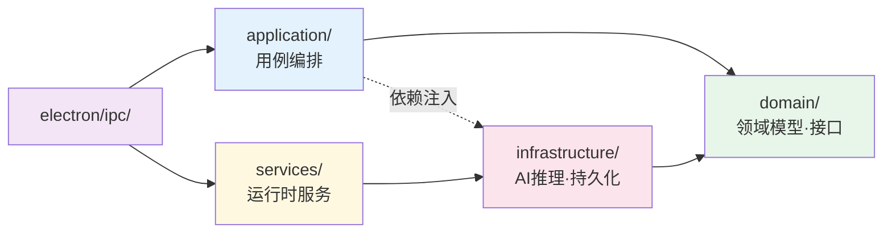
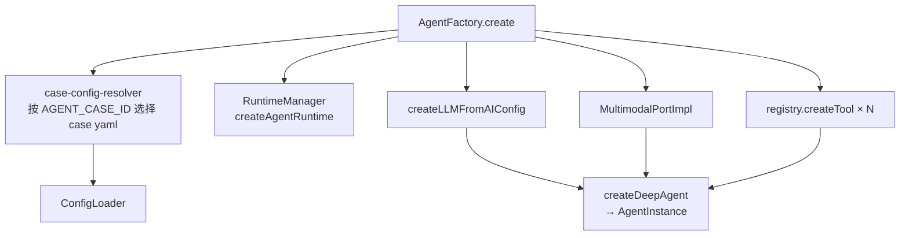
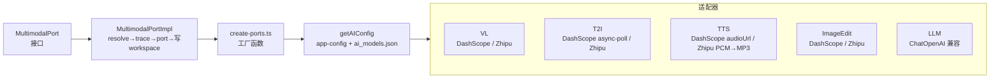
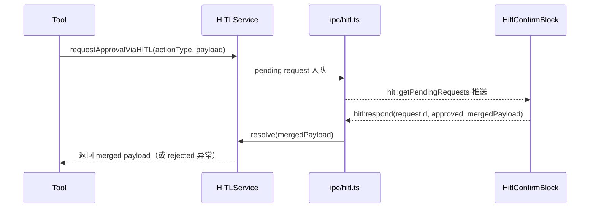
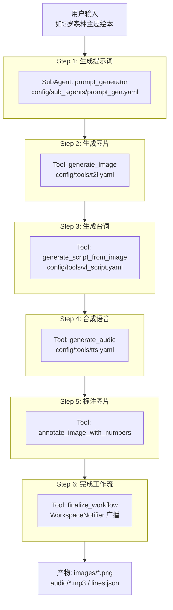

# 后端架构文档

## 概述

后端运行于 Electron **主进程**（Main Process），采用**领域驱动设计（DDD）**分层架构，负责智能体编排、AI 服务调用、会话管理、文件系统操作和配置管理。与渲染进程**仅通过 IPC 通信，无独立 HTTP 服务**。

---

## 分层架构



依赖方向：`domain ← application ← infrastructure ← services ← electron/ipc`

---

## 目录结构

```
backend/
├── app-config.ts                   # AppConfig：electron-store 配置读写封装
├── workspace-notifier.ts           # WorkspaceNotifier：工作区变更事件广播
│
├── agent/                          # 智能体核心
│   ├── AgentFactory.ts             # 配置驱动创建主 Agent、Tool、LLM、MultimodalPort、Checkpointer
│   ├── ConfigLoader.ts             # YAML 配置加载器（主配置、sub_agents、tools）
│   ├── case-config-resolver.ts     # 按 AGENT_CASE_ID 解析 case 配置路径
│   ├── langsmith.ts                # LangSmith 环境初始化
│   └── langsmith-trace.ts          # 多模态调用 trace 写入 LangSmith
│
├── application/                    # 应用层
│   ├── agent/                      # 会话与 Agent 用例
│   │   ├── index.ts
│   │   ├── create-session-use-case.ts
│   │   ├── list-sessions-use-case.ts
│   │   ├── get-session-use-case.ts
│   │   ├── update-session-use-case.ts
│   │   ├── delete-session-use-case.ts
│   │   ├── invoke-agent-use-case.ts
│   │   └── run-context.ts          # AsyncLocalStorage RunContext（跨异步边界传递）
│   ├── session/
│   └── helpers/
│       └── resolve-step-result-paths.ts
│
├── domain/                         # 领域层（零外部依赖）
│   ├── index.ts
│   ├── inference/                  # 推理端口与类型
│   │   ├── ports/                  # SyncInferencePort、AsyncInferencePort、MultimodalPort、BatchInferencePort
│   │   ├── value-objects/          # PromptInput、content-input
│   │   ├── types.ts                # 所有 AI 能力的参数/结果类型
│   │   └── index.ts
│   ├── session/                    # Session 实体（聚合根）、SessionMeta 值对象、SessionRepository
│   ├── workspace/                  # ArtifactRepository
│   └── configuration/              # ConfigRepository
│
├── infrastructure/                 # 基础设施层
│   ├── repositories.ts             # 单例仓储/端口工厂（getSessionRepository 等）
│   ├── inference/
│   │   ├── ai-config.ts            # getAIConfig：从 app-config + ai_models.json 解析 provider/model/endpoint
│   │   ├── multimodal-port-impl.ts # MultimodalPortImpl：resolve → trace → 调用端口 → 写 workspace
│   │   ├── create-ports.ts         # 工厂函数：createVLPort / createT2IPort / createEditImagePort / createTTSSyncPort
│   │   ├── port-types.ts           # 端口输入类型别名
│   │   ├── bases/                  # 基础适配器类
│   │   └── adapters/
│   │       ├── llm/                # dashscope.ts、zhipu.ts（创建 ChatOpenAI 实例）
│   │       ├── vl/                 # VLDashScopePort、VLZhipuPort
│   │       ├── t2i/                # T2IDashScopePort（async poll）、T2IZhipuPort
│   │       ├── tts/                # TTSDashScopePort、TTSZhipuPort（PCM 输出）
│   │       └── image-edit/         # EditImageDashScopePort、EditImageZhipuPort
│   └── persistence/
│       ├── index.ts
│       ├── session/                # SessionFsRepository
│       ├── workspace/              # ArtifactFsRepository
│       └── configuration/          # ConfigElectronStoreRepository
│
├── services/                       # 运行时服务（可依赖 infrastructure，不 import electron/）
│   ├── service-initializer.ts      # 服务初始化入口
│   ├── runtime-manager.ts          # RuntimeManager：按 sessionId 管理 AgentRuntime
│   ├── fs.ts                       # WorkspaceFilesystem：路径安全校验，resolveWorkspaceRoot
│   ├── workspace-service.ts        # WorkspaceService：工作区 CRUD
│   ├── hitl-service.ts             # HITLService：Human-in-the-loop 状态机
│   ├── persistence-service.ts      # PersistenceService：Checkpoint 生命周期管理
│   ├── workspace-checkpoint-saver.ts  # LangGraph checkpoint 存到 workspaces/{sessionId}/checkpoints/
│   ├── log-manager.ts              # LogManager：audit / hitl / system / llm 日志
│   ├── audio-format.ts             # pcmToMp3、pcmToWav（via FFmpeg）
│   ├── image-annotation.ts         # 图片数字标注服务
│   └── sync-audio-to-store.ts      # 音频同步到 electron-store
│
├── tools/                          # 内置工具（实现 LangChain StructuredToolInterface）
│   ├── registry.ts                 # 工具注册表：registerTool / createTool
│   ├── types.ts                    # BatchSubTask、BatchProgress 公共类型
│   ├── index.ts
│   ├── generate-image.ts           # 文生图（T2I）
│   ├── edit-image.ts               # 图片编辑
│   ├── synthesize-speech-single.ts # 单条 TTS 合成
│   ├── generate-script-from-image.ts  # 以图生剧本（VL）
│   ├── annotate-image-numbers.ts   # 在图片上标注序号
│   ├── batch-tool-wrapper.ts       # 批量工具包装器（统一 BatchProgress 推送）
│   ├── delete-artifacts.ts         # 删除 session 下产物
│   ├── finalize-workflow.ts        # 检查产物完整性，完成工作流
│   └── line-numbers.ts             # 台词行号分配工具
│
├── config/                         # 配置文件（运行时动态加载，无需重新构建）
│   ├── ai_models.json              # 各 provider 下 llm/vl/tts/t2i 的 endpoint、model
│   ├── hitl-config.ts
│   ├── workspace-config.ts
│   ├── log-config.ts
│   ├── feature-flags.ts
│   ├── agent_cases/                # 各案例主配置（encyclopedia.yaml 等）
│   ├── sub_agents/
│   │   └── prompt_gen.yaml         # 提示词生成子代理
│   ├── tools/                      # 工具业务参数
│   │   ├── t2i.yaml
│   │   ├── tts.yaml
│   │   ├── vl_script.yaml
│   │   └── image_edit.yaml
│   └── skills/                     # Agent skill 配置
│
├── interfaces/
│   └── http/                       # HTTP 路由（已实现，但 Electron 主进程未挂载 Express）
│       ├── session-routes.ts       # Session CRUD，委托应用层用例
│       └── fs-routes.ts            # 文件系统操作，委托 ArtifactRepository
│
└── utils/
    └── storage.ts
```

---

## 核心模块详解

### 1. AgentFactory（`backend/agent/AgentFactory.ts`）

智能体的**唯一构造入口**，基于 `deepagents` / `langchain` 框架构建运行时实例。



- 读取 `backend/config/agent_cases/{caseId}.yaml` 主配置（默认 `encyclopedia.yaml`）
- 按 `tools` 段调用 `registry.createTool(name, config, context)`，注入 HITL、MultimodalPort、FilesystemBackend
- 绑定 LangSmith 追踪（通过环境变量 `LANGCHAIN_TRACING_V2` 开启）
- 注入 `WorkspaceCheckpointSaver` 支持 LangGraph checkpoint

### 2. AppConfig（`backend/app-config.ts`）

封装 `electron-store`，提供类型安全的配置读写：

- 存储路径：`{userData}/config.json`（Windows: `%APPDATA%\jiaojiao\config.json`）
- 顶层配置键：`apiKeys`、`multimodalApiKeys`、`agent`（model / provider / temperature）、`storage`（outputPath）、`ui`

### 3. RuntimeManager（`backend/services/runtime-manager.ts`）

按 `sessionId` 管理 `AgentRuntime` 实例（一 session 一 runtime）：

```typescript
interface AgentRuntime {
  sessionId: string;
  workspaceService: WorkspaceFilesystem;
  persistenceService: PersistenceService;   // checkpoint 生命周期
  logManager: LogManager;
  hitlService: HITLService;
  metadata: { createdAt, lastActiveAt, totalTokens, totalRequests };
}
```

### 4. AI 推理层（`backend/infrastructure/inference/`）



| 能力 | 端口类型 | DashScope 实现 | Zhipu 实现 |
|---|---|---|---|
| LLM | `createLLMFromAIConfig()` | qwen-plus 系列 | GLM-4.x |
| T2I | `AsyncInferencePort`（submit+poll） | wan2.6-t2i | glm-image |
| ImageEdit | `SyncInferencePort` | wan2.6 图像编辑 | glm-image edit |
| TTS | `SyncInferencePort` | qwen-tts（audioUrl） | glm-tts（PCM→MP3） |
| VL | `SyncInferencePort` | 通义千问-VL | GLM-4V |

### 5. Tools 与 Registry（`backend/tools/`）

工具遵循**配置驱动**模式，由 `agent_cases/{caseId}.yaml` 的 `tools` 段声明，`registry.createTool` 负责实例化：

```typescript
interface ToolContext {
  requestApprovalViaHITL(actionType, payload): Promise<Record<string, unknown>>;
  getDefaultSessionId(): string;
  getSessionBackend?(sessionId): FilesystemBackend;  // deepagents 文件系统
  getRunContext?(): RunContext | undefined;            // TTS/批量进度推送
  getToolConfig?(toolName): ToolConfig | undefined;   // 批量工具获取单步配置
}
```

| 工具名 | 文件 | 说明 |
|---|---|---|
| `generate_image` | `generate-image.ts` | 文生图（T2I），HITL 确认后调用 `MultimodalPort.generateImage()` |
| `edit_image` | `edit-image.ts` | 图片编辑，调用 `MultimodalPort.editImage()` |
| `generate_audio` | `generate-audio.ts` + `batch-tool-wrapper.ts` | 音频生成，批量场景通过 `batch_tool_call` 推送 `BatchProgress` |
| `generate_script_from_image` | `generate-script-from-image.ts` | 以图生台词+坐标（VL），HITL 确认 |
| `annotate_image_with_numbers` | `annotate-image-with-numbers.ts` | 在图片上标注序号，HITL 确认位置 |
| `delete_artifacts` | `delete-artifacts.ts` | 删除 session 下指定产物，HITL 确认 |
| `finalize_workflow` | `finalize-workflow.ts` | 检查图片/音频/台词完整性，广播完成事件 |
| `line_numbers` | `line-numbers.ts` | 台词行号分配（`readLineNumbers`） |

**批量工具**（`batch-tool-wrapper.ts`）：统一包装单步工具，通过 `RunContext.onBatchProgress` 向前端推送 `BatchProgress`，前端 `BatchWrapper` 组件渲染进度。

### 6. HITLService（`backend/services/hitl-service.ts`）

Human-in-the-loop 状态机，工作流在关键节点暂停等待用户审批：



HITL 动作类型：`ai.text2image` / `ai.text2speech` / `ai.vl_script` / `ai.image_label_order` / `artifacts.delete`

用户取消时工具抛 `cancelled by user` 异常，当前 run 结束；下次发消息时从 LangGraph checkpoint 恢复。

### 7. 会话管理

每次对话对应一个 **Session**（聚合根）：

| 层 | 组件 | 职责 |
|---|---|---|
| domain | `Session` 实体 / `SessionMeta` 值对象 | 结构定义 |
| domain | `SessionRepository` 接口 | CRUD 契约 |
| infrastructure | `SessionFsRepository` | 以 JSON 文件实现仓储 |
| application | `create/list/get/update/delete-session-use-case` | 用例编排 |
| services | `WorkspaceFilesystem` | 路径安全校验，防止路径穿越 |

工作区目录结构：

```
outputs/workspaces/{sessionId}/
├── images/              # 生成的 PNG 图片
├── audio/               # 生成的 MP3/WAV 音频
├── meta/
│   ├── session.json     # SessionMeta
│   └── messages.json    # 消息历史（优先读取）
├── llm_logs/            # LLM 交互详细日志
└── checkpoints/         # LangGraph 工作流快照
```

### 8. Checkpoint 与持久化

- **WorkspaceCheckpointSaver**：按 `thread_id`（= `sessionId`）将 LangGraph checkpoint 序列化到 `workspaces/{sessionId}/checkpoints/`
- **PersistenceService**：管理 CheckpointSaver 生命周期，支持 `closeCheckpointer(sessionId)`
- 工具执行前 HITL 等待；用户取消 → 工具抛错 → run 结束；再次发消息从 checkpoint 恢复

---

## 智能体工作流（6 步流水线）



> 每个关键步骤内置 HITL 确认门，用户可审批/修改后继续，或取消后从 checkpoint 恢复重试。

---

## 配置体系

```mermaid
flowchart TD
    ENV[.env\n开发环境变量]
    UC[userData/config.json\nelectron-store\nAPI Key / provider / model]
    AIM[backend/config/ai_models.json\nendpoint / model 元数据]
    MAIN[backend/config/agent_cases/{caseId}.yaml\n主 Agent 定义]
    SUB[backend/config/sub_agents/*.yaml\n子代理]
    TOOL[backend/config/tools/*.yaml\n工具业务参数]

    ENV -->|最高优先级| UC
    UC --> AIM
    AIM --> MAIN
    MAIN --> SUB
    MAIN --> TOOL
```

| 配置文件 | 作用 |
|---|---|
| `userData/config.json` | API Key、provider、model、outputPath 等用户持久化设置 |
| `backend/config/ai_models.json` | 各 provider 下 llm / vl / tts / t2i 的 endpoint、model、taskEndpoint |
| `backend/config/agent_cases/*.yaml` | 主 Agent 定义：tools 段（含 config_path）、sub_agents 段、workflow |
| `backend/config/tools/*.yaml` | 工具业务参数（negativePrompt、voice、size 等） |
| `backend/config/sub_agents/*.yaml` | 子代理提示词与配置 |

---

## IPC 通道完整列表

> 详见 [ipc.md](./ipc.md)。

| 前缀 | 通道 | 说明 |
|---|---|---|
| `session:` | create / list / get / update / delete | 会话生命周期 |
| `agent:` | sendMessage（流式）、stopStream、quotaExceeded（推送） | 智能体执行 |
| `config:` | get / set / getAiModels / getWorkspaceDir / openConfigDir / showOutputPathDialog / openFolder | 应用配置 |
| `fs:` | ls / readFile / getFilePath / glob / grep | 工作区文件系统 |
| `hitl:` | respond / getPendingRequests / cancel | 人工审批 |
| `sync:` | audioToStore | 音频同步 |
| `storage:` | getHistory / saveHistory / getBook / saveBook | 历史/绘本持久化 |

---

## 链路追踪与日志

| 类型 | 方式 | 输出 |
|---|---|---|
| LLM 调用 | LangChain 自动上报（`LANGCHAIN_TRACING_V2`） | LangSmith |
| 多模态调用 | `traceAiRun`（`langsmith-trace.ts`）包裹 MultimodalPortImpl | LangSmith |
| Agent 工具调用 | LangSmith trace | LangSmith |
| 系统事件 | `logManager.logSystem()` | `workspaces/{id}/llm_logs/` |
| 错误/警告 | `console.error` / `console.warn` | 控制台 |

---

## 扩展开发

### 新增工具

1. 在 `backend/tools/` 实现工具（`registerTool(name, factory)` 注册）
2. 在主配置 `agent_cases/{caseId}.yaml` 的 `tools` 段添加条目，`config_path` 指向 `config/tools/*.yaml`
3. 如需批量执行，用 `batch-tool-wrapper.ts` 包装单步工具

### 新增子代理

1. 在 `backend/config/sub_agents/` 添加 YAML 配置
2. 在主配置的 `sub_agents` 段引用

### 新增 AI 能力

1. 在 `domain/inference/types.ts` 定义参数/结果类型
2. 在 `domain/inference/ports/` 定义新端口接口（可选）
3. 在 `infrastructure/inference/adapters/` 实现 DashScope / Zhipu 适配器
4. 在 `infrastructure/inference/create-ports.ts` 添加工厂函数
5. 可选：扩展 `MultimodalPort` 接口和 `MultimodalPortImpl`

### 新增 AI 服务商

1. 在 `infrastructure/inference/adapters/` 下新建服务商目录（参考 `dashscope/` 或 `zhipu/`）
2. 在 `backend/config/ai_models.json` 添加该服务商的 endpoint/model 配置
3. 在 `create-ports.ts` 的工厂函数中增加 provider 分支

---

## 关键设计原则

1. **DDD 分层隔离**：Domain 层零依赖，Infrastructure 实现而非定义接口
2. **会话隔离**：每个 Session 有独立工作区，`WorkspaceFilesystem` 强制路径边界
3. **配置驱动**：工具/子代理行为通过 YAML 声明，无需改代码即可调整流程
4. **多提供商抽象**：AI 能力通过 `MultimodalPort` 屏蔽提供商差异，运行时注入
5. **HITL 支持**：关键步骤可配置人工审批门，结合 checkpoint 支持随时暂停/恢复
6. **可观测性**：LangSmith 追踪 + `llm_logs/` 全量日志，支持问题复现
