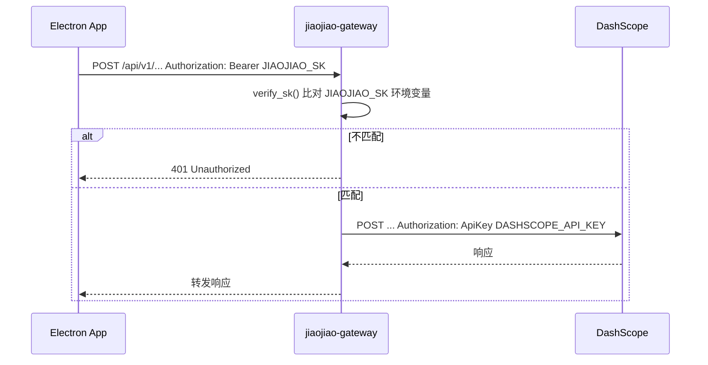
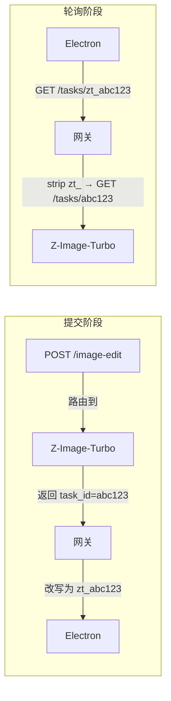
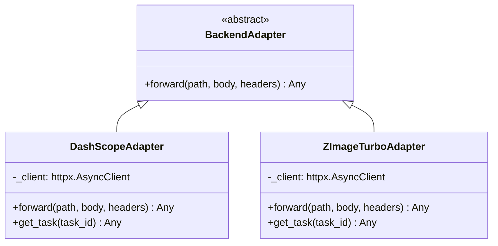
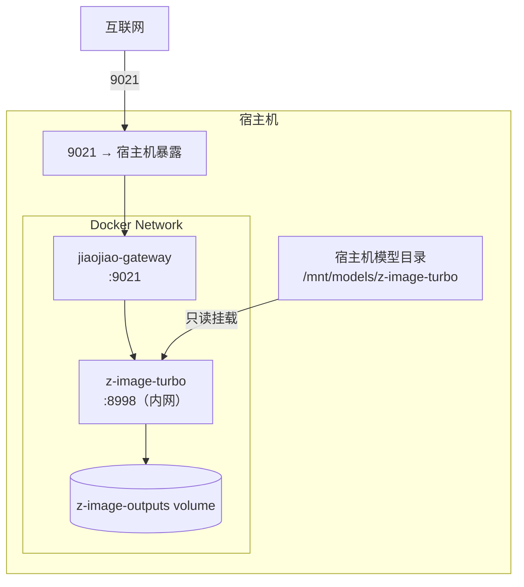

# jiaojiao-gateway 架构

> 源码位置：`deploy/jiaojiao-gateway/`

---

## 概述

**jiaojiao-gateway** 是一个轻量级 Python/FastAPI 反向代理，承担以下职责：

- **统一入口**：Electron 桌面端通过单一地址（`:9021`）访问所有 AI 能力，无需在客户端代码里管理多套 API 密钥和上游 URL
- **路由分发**：按请求路径将流量路由至 DashScope（云端）或 Z-Image-Turbo（本地 GPU）；其中 T2I 由 `T2I_BACKEND` 决定走向
- **鉴权隔离**：客户端持有轻量级网关密钥 `JIAOJIAO_SK`，网关持有真实的 DashScope API Key，两者分离
- **任务 ID 命名空间**：用 `zt_` 前缀区分 Z-Image-Turbo 异步任务，让轮询路由无需依赖调用方传参
- **公开图片代理**：通过 `/z-image-turbo/images/{filename}` 对外暴露图片下载，避免客户端解析 Docker 内网域名失败

---

## 系统组成

```mermaid
flowchart TD
    subgraph Client["客户端（Electron）"]
        APP["Electron App\n(infrastructure/inference/adapters)"]
    end

    subgraph Gateway["jiaojiao-gateway 容器 :9021"]
        GW["FastAPI server.py"]
        AUTH["auth.py\nBearer SK 鉴权"]
        R_AIGC["routes/aigc.py\nTTS · T2I · 图像编辑"]
        R_PUBLIC["routes/public.py\n图片公开代理"]
        R_TASKS["routes/tasks.py\n任务轮询"]
        R_VL["routes/vl.py\nVL 视觉语言"]
        AD_DS["DashScopeAdapter"]
        AD_ZIT["ZImageTurboAdapter"]
    end

    subgraph Backends["上游后端"]
        DS["DashScope\n（阿里云）"]
        ZIT["Z-Image-Turbo\n本地推理服务 :8998"]
    end

    APP -->|"Bearer JIAOJIAO_SK"| GW
    GW --> AUTH
    AUTH --> R_AIGC & R_TASKS & R_VL
    GW --> R_PUBLIC
    R_AIGC -->|TTS| AD_DS
    R_AIGC -->|T2I (T2I_BACKEND=dashscope)| AD_DS
    R_AIGC -->|T2I (T2I_BACKEND=z-image-turbo)| AD_ZIT
    R_AIGC -->|图像编辑| AD_ZIT
    R_TASKS -->|task_id 无 zt_ 前缀| AD_DS
    R_TASKS -->|task_id 有 zt_ 前缀| AD_ZIT
    R_PUBLIC -->|/images/* 代理| ZIT
    R_VL -->|透传 + 流式 SSE| DS
    AD_DS -->|"ApiKey DASHSCOPE_API_KEY"| DS
    AD_ZIT --> ZIT
```

---

## 目录结构

```
deploy/jiaojiao-gateway/
├── server.py              # FastAPI 应用入口，注册三组路由
├── config.py              # 全局配置，从环境变量读取
├── auth.py                # Bearer Token 鉴权 FastAPI Dependency
├── requirements.txt       # Python 依赖（fastapi / uvicorn / httpx / pydantic）
├── Dockerfile             # python:3.11-slim，暴露 PORT(9021)
├── docker-compose.yml     # 编排 jiaojiao-gateway + z-image-turbo
├── .env.example           # 环境变量模板
├── routes/
│   ├── aigc.py            # AIGC 路由（TTS / T2I / 图像编辑）
│   ├── tasks.py           # 异步任务状态轮询
│   └── vl.py              # 视觉语言推理（OpenAI 兼容接口）
├── adapters/
│   ├── base.py            # BackendAdapter 抽象基类
│   ├── dashscope.py       # DashScope 上游适配器
│   └── z_image_turbo.py   # Z-Image-Turbo 本地适配器
└── z-image-turbo/         # 本地 GPU 推理微服务（独立子项目）
    ├── server.py
    ├── Dockerfile
    └── requirements.txt

deploy/
└── docker-compose.yml     # 唯一编排入口（gateway + z-image-turbo + gateway-test）
```

---

## 路由表

| 路径 | 方法 | 后端 | 能力 |
|---|---|---|---|
| `/compatible-mode/v1/chat/completions` | POST | DashScope | VL 视觉语言，支持 SSE 流式 |
| `/api/v1/services/aigc/multimodal-generation/generation` | POST | DashScope | TTS 语音合成 |
| `/api/v1/services/aigc/image-generation/generation` | POST | `T2I_BACKEND` 决定 | T2I 文生图（`z-image-turbo` 或 `dashscope`） |
| `/api/v1/services/aigc/image-generation/image-edit` | POST | Z-Image-Turbo | 图像编辑（img2img） |
| `/api/v1/tasks/{task_id}` | GET | 按前缀路由 | `zt_*` → Z-Image-Turbo；其余 → DashScope |
| `/z-image-turbo/images/{filename}` | GET | 网关代理到 Z-Image-Turbo | 图片公开下载（无鉴权） |
| `/health` | GET | 网关自身 | 健康检查，返回 `{status, port}` |

---

## 鉴权机制



- 客户端（Electron）只需持有 `JIAOJIAO_SK`，不接触 DashScope API Key
- 转发时网关剥除客户端的 `Authorization` 头，改注入 `ApiKey <DASHSCOPE_API_KEY>`
- `host`、`content-length`、`transfer-encoding` 等逐跳头均不转发至上游

---

## 任务 ID 命名空间

DashScope 与 Z-Image-Turbo 的异步任务均通过 `GET /api/v1/tasks/{task_id}` 轮询，网关通过 `zt_` 前缀区分来源：



Z-Image-Turbo 的 `task_id` 前加 `zt_` 返回给调用方，轮询时网关识别前缀并 strip 后转发，实现**无状态路由**。

---

## 适配器层



- 所有适配器使用 `httpx.AsyncClient`（timeout=300s）发起异步 HTTP 请求
- 新增上游后端只需继承 `BackendAdapter` 并在对应路由注入即可

---

## Z-Image-Turbo 子服务

`z-image-turbo/` 是独立的本地 GPU 推理微服务，实现与 DashScope T2I / image-edit 兼容的异步任务 API：

| 端点 | 说明 |
|---|---|
| `POST /api/v1/services/aigc/image-generation/generation` | 文生图，返回 `{output: {task_id}}` |
| `POST /api/v1/services/aigc/image-generation/image-edit` | 图像编辑，返回 `{output: {task_id}}` |
| `GET /api/v1/tasks/{task_id}` | 轮询任务状态 |
| `GET /images/{filename}` | 静态文件服务（生成图片） |
| `GET /health` | 健康检查 |

- 使用 `ZImagePipeline`（modelscope ≥ 1.22 或 diffusers 回退），支持 bfloat16 + NVIDIA GPU
- 推理用 `threading.Lock` 串行化，同一时刻只允许一次 GPU 推理
- 任务状态存储于内存 `_tasks` 字典（进程重启后丢失）

---

## 配置与环境变量

| 变量 | 默认值 | 说明 |
|---|---|---|
| `JIAOJIAO_SK` | `jjtk-20260306-default` | 网关鉴权密钥（客户端使用） |
| `DASHSCOPE_API_KEY` | —（必填） | DashScope 上游 API Key |
| `DASHSCOPE_BASE_URL` | `https://dashscope.aliyuncs.com` | DashScope 上游基址 |
| `Z_IMAGE_TURBO_URL` | `http://z-image-turbo:8998` | Z-Image-Turbo 服务地址 |
| `Z_IMAGE_PUBLIC_URL` | `http://localhost:9021/z-image-turbo` | 返回给客户端的图片 URL 前缀 |
| `T2I_BACKEND` | `z-image-turbo` | T2I 路由后端（`z-image-turbo`/`dashscope`） |
| `PORT` | `9021` | 网关监听端口 |
| `MODEL_PATH` | `/mnt/models/z-image-turbo` | GPU 模型权重挂载路径（宿主机） |

> `JIAOJIAO_SK` 的默认值与 `backend/config/ai_models.json` 中 `jiaojiao.defaultApiKey` 保持一致，便于开发环境零配置启动。

---

## 部署拓扑



- `z-image-turbo` 端口不对外暴露，仅供网关内网访问
- GPU 模型通过只读 bind mount 挂载，容器无写权限
- 网关通过 `healthcheck`（`/health`）进行健康探测
- `z-image-turbo` 会先加载模型并执行 warmup，只有 warmup 完成后 health 才会变为 healthy

---

## 测试前检查（必须）

`z-image-turbo` 预热较慢（模型加载 + 首轮 warmup），在执行任何集成测试前必须确认其状态。

1. 检查容器健康状态（必须是 `healthy`）：

```bash
docker ps --filter name=z-image-turbo
```

2. 检查网关健康：

```bash
curl http://localhost:9021/health
```

3. 如果 `z-image-turbo` 仍是 `starting`，请等待；不要立刻跑测试，否则容易出现超时或 5xx。

4. 必要时调高预热相关参数：
`WARMUP_ON_START`、`WARMUP_SIZE`、`WARMUP_STEPS`。

---

## 快速部署

```bash
# 1. 准备环境变量
cd deploy
cp .env.example .env
# 编辑 .env：填写 DASHSCOPE_API_KEY 和 MODEL_PATH

# 2. 构建并启动
docker compose up -d

# 3. 验证
curl http://localhost:9021/health
# → {"status":"ok","port":9021}
```

> **本地开发**：在 `hosts` 文件中添加 `127.0.0.1  jiaojiao.ai`，即可通过 `http://jiaojiao.ai:9021` 访问，与 `ai_models.json` 中的 `baseUrl` 一致。
